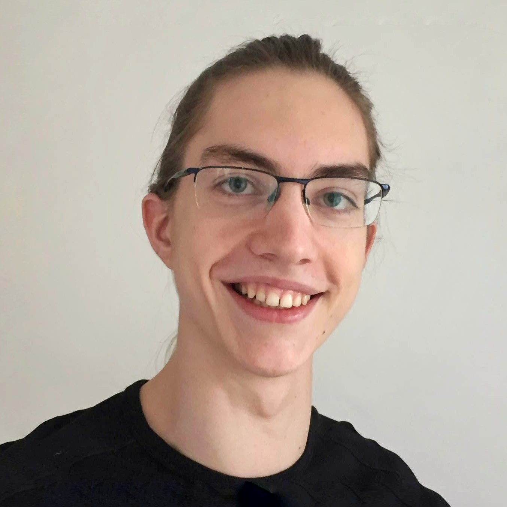
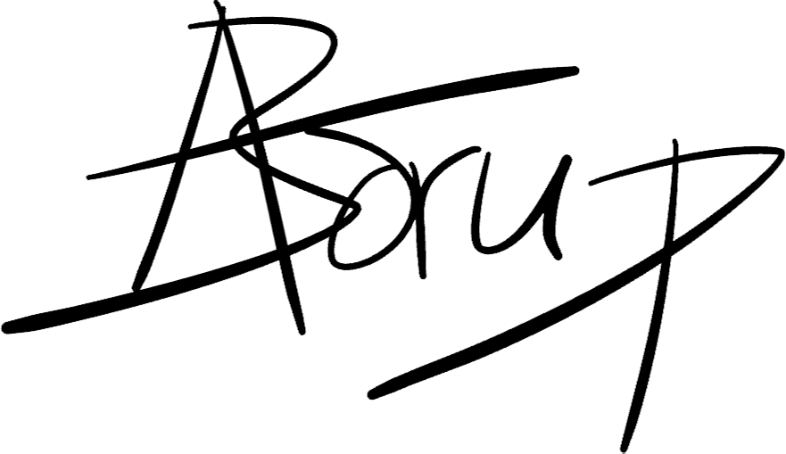
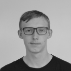
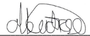
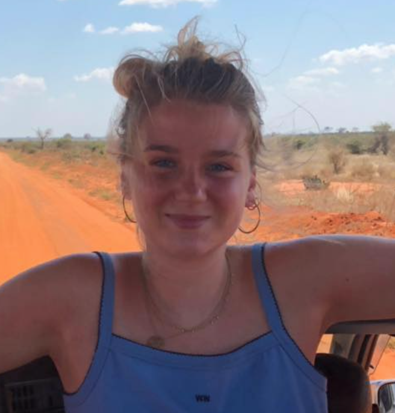
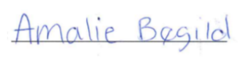
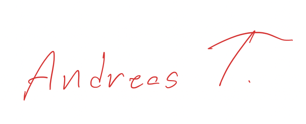
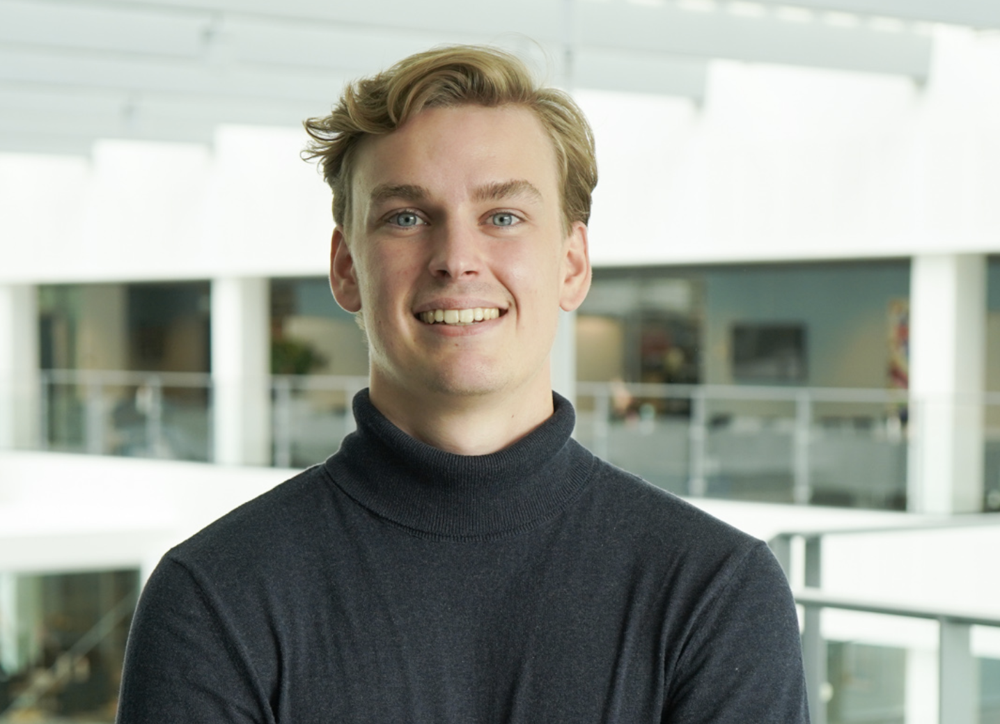
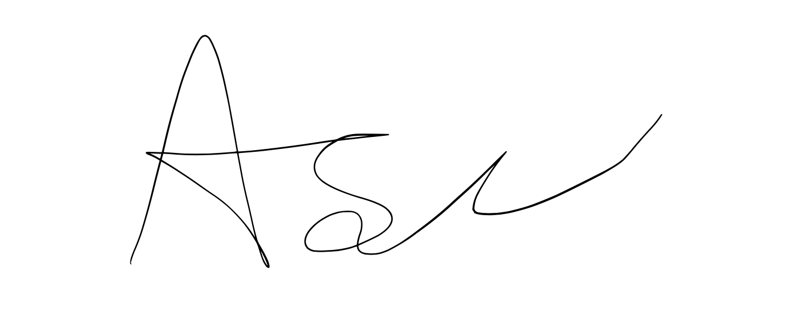
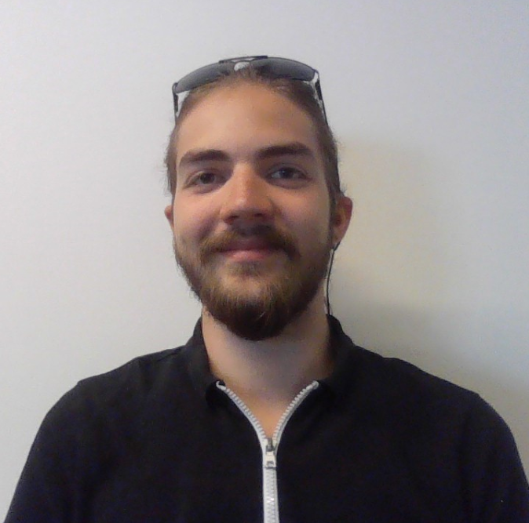

# Group constitution
- [Group constitution](#group-constitution)
  - [Signatures](#signatures)
  - [Organisation](#organisation)
  - [Ambition](#ambition)
  - [Tools](#tools)
  - [Discussions and decisions](#discussions-and-decisions)
  - [Documentation](#documentation)
  - [Workflow](#workflow)
  - [Meeting structure](#meeting-structure)

## Signatures
| Picture                                                      | Name and email                        | Signature                                                      |
| ------------------------------------------------------------ | ------------------------------------- | -------------------------------------------------------------- |
|           | Adrian Valdemar Borup (adbo@itu.dk)   |           |
|           | Albert Rise Nielsen (albn@itu.dk)     |           |
|  | Amalie Bøgild (abso@itu.dk) |  |
|  | Andreas Nicolaj Tietgen (anti@itu.dk) |  |
|  | Asger Mathiasen (asgm@itu.dk) |  |
|  | Joachim Alexander Borup (aljb@itu.dk) |  |

## Organisation
- The group has one project leader, Adrian Valdemar Borup.
- The group has one SCRUM master, Adrian Valdemar Borup.
- The group has one scribe, Albert Rise Nielsen.
- The scribe is responsible for writing release notes.
- Group members are assigned permanent roles. These roles can be changed throughout the course of the project, but will be immediately applicable for the remainder of the time.
- In the event that there are tasks that no one specifically wants to handle, these tasks can go round and round, so that a role distribution is achieved that is both fixed for some roles, but also loose for others.

## Ambition
- The group aims to develop a high quality vertical slice. The level of ambition in the group is high, but the ultimate goal of the collective work is quality rather than quantity.
- The group aims to keep a consistent intensity throughout the whole project period. The work is done with appropriate intensity, such that minimal work is left as the project nears it's end.
- The group aims to work in such a way as to avoid burn out and stress while keeping a stead-fast pace and completing work assignments on time.

## Tools
- The group has agreed upon using Discord for communication. The group members can also log on while they are working to indicate their availability.
- The group will use Overleaf for writing the report with LaTeX.
- The group will use GitHub actions as CI/CD for automatic testing and building
- The group will use GitHub Projects in conjunction with GitHub issues to assign tasks.
	- Issues and pull requests will be prefixed with "[FIX]", "[FEATURE]", "[DOCS]" etc. to provide context for the pull request/issue
  - The order of tasks on the project board defines priority.
  - We will use templates for pull requests and issues to describe features and bugs.
- The group will use Git as version control software, using the official GitHub repository.
   - We write a 50 character max commit message followed by an empty line, and then a more in-depth description (if necessary) line-wrapped at 72 characters.
	 - Accepted pull requests will be squash merged
	 - The group will follow the following branch conventions:
     | Branch name | Branch function                   | Rules                                 |
     | ----------- | --------------------------------- | ------------------------------------- |
     | `master`    | Stable program and features       | No direct commits, only pull requests |
     | `feature/*` | New features                      | None                                  |
     | `fix/*`     | Fix bugs, refactoring, or related | None                                  |

## Discussions and decisions
- The group makes decisions on conclusions of discussions.
- The subjects that cannot be agreed upon will fall upon the group leader to make the best compromise.
- The degree of formality depends on the meeting type.
- The scribe will document discussions thoroughly.
- Discussions are primarily planned for friday meetings, but group members are free to discuss the subjects of the project in the rest of the week.
- The group members will be open to receive and give suggestions.

## Documentation
- We will produce all documentation in English.
- The group members have an individual responsibility to take care of personal notes, where technical descriptions of their work are available to explain what the meaning of their work is.
- Issues on GitHub are marked with next week's release tag as a milestone. In this way, we have a concrete connection between the issues and the release they were resolved in.
- Report writing takes place on an ongoing basis with the rest of the project.

## Workflow
- The group aims toward a high level of thoroughness in the final product. An approach to the immediate work throughout the process is to quickly develop working prototypes for features and **then** work towards elegant solutions.
- The group aims to work by **test driven development** on the backend.
- User tests: parts of the system, such as the frontend, that are not immediately able to be tested by unit tests will be tested by users such as family members of the group members, or any other unlucky soul that is in the immediate vicinity of any one group member.

## Meeting structure
- The meetings have regular meeting subjects, which will be discussed at each meeting.
- The group will meet on ITU, if ITU is not available, meetings will be on Discord.
- The group will officially meet
    - Wednesday:
       - Scrum meeting, 12:45-13:00
    - Friday:
       - Scrum meeting, 12:45-13:00
       - TA-meeting, 13:05-13:25
       - Work, 10:00-15:00
- Scrum meetings have the following structure:
    1. What have we done since last time?
    2. Have we had any challenges?
    3. What do we have to accomplish today and what are we missing from last time?
- Fridays and wednesdays are designated work days. Work that is otherwise planned to be done can be completed at the group members own pace.
